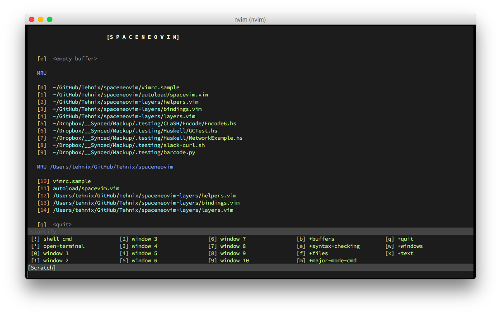

# SpaceNeovim - Spacemacs for Neovim [](https://travis-ci.org/tehnix/spaceneovim)

SpaceNeovim is [Spacemacs](https://github.com/syl20bnr/spacemacs) for vim. Forked from [ctjhoa/spacevim](https://github.com/ctjhoa/spacevim) and rewritten/restructured almost entirely (but still majorly inspired by the original fork).

Unlike Spacevim, SpaceNeovim specifically does not focus on support vim, and takes advantage of Neovim specific functions.



## Installation

Prerequisites:

* `git` on your path
* `nvim` on your path

SpaceNeovim is a configurable distribution like Spacemacs.

To start using SpaceNeovim you can use the following oneliner,

```shell
mkdir -p ~/.config/nvim/ && curl -sSfL https://raw.githubusercontent.com/tehnix/spaceneovim/master/vimrc.sample -o ~/.config/nvim/init.vim | nvim
```

It will download a default `init.vim` which in turn takes care of setting up the
rest by:

* Downloading `autoload/spacevim.vim`
* Setting up [vim-plug](https://github.com/junegunn/vim-plug)
* Cloning down the [layers repository](https://github.com/Tehnix/spaceneovim-layers)
* Installing default plugins

## Layers

Go to the [layers repository](https://github.com/Tehnix/spaceneovim-layers) for
more information on the different layers.

To enable a layer, include it in `g:dotspacevim_configuration_layers` inside the `dotspacevim/init` block. For example, the following enables the `+checkers/syntax-checking` layer,

```viml
let g:dotspacevim_configuration_layers = [
\  '+checkers/syntax-checking'
\]
```

You can also add custom layers to `g:dotspacevim_additional_plugins`, which will be installed with `vim-plug`.

## License

See [LICENSE](LICENSE).
